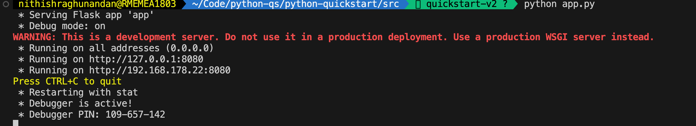
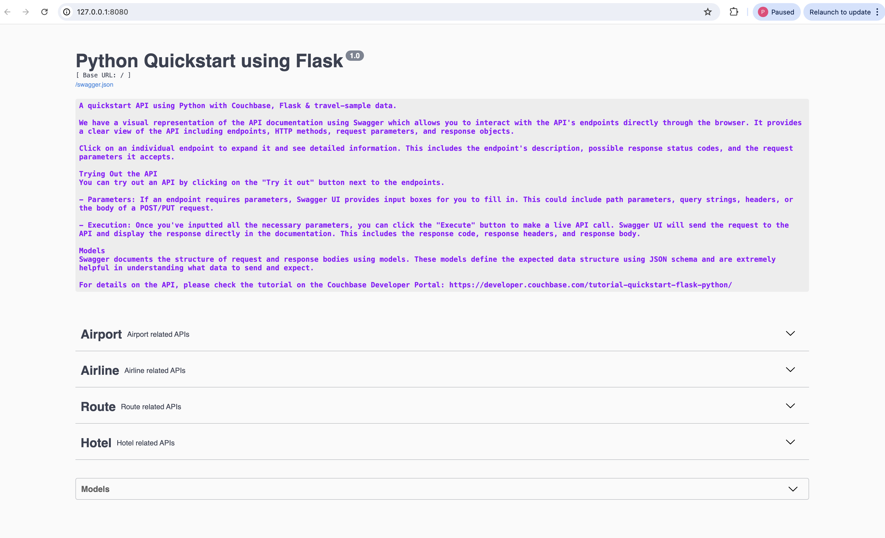

# Quickstart in Couchbase with Flask and Python

#### Build a REST API with Couchbase's Python SDK (4.x) and Flask

> This repo is designed to teach you how to connect to a Couchbase Capella cluster to create, read, update, and delete documents and how to write simple parametrized SQL++ queries using the built-in travel-sample bucket. If you want to run this tutorial using a self managed Couchbase cluster, please refer to the [appendix](#appendix-running-self-managed-couchbase-cluster).

Full documentation for the tutorial can be found on the [Couchbase Developer Portal](https://developer.couchbase.com/tutorial-quickstart-flask-python/).

## Prerequisites

To run this prebuilt project, you will need:

- Couchbase Server (7 or higher) with [travel-sample](https://docs.couchbase.com/python-sdk/current/ref/travel-app-data-model.html) bucket loaded.
  - [Couchbase Capella](https://www.couchbase.com/products/capella/) is the easiest way to get started.
- [Python](https://www.python.org/downloads/) 3.9 or higher installed
  - Ensure that the Python version is [compatible](https://docs.couchbase.com/python-sdk/current/project-docs/compatibility.html#python-version-compat) with the Couchbase SDK.

### Loading Travel Sample Bucket

If travel-sample is not loaded in your Capella cluster, you can load it by following the instructions for your Capella Cluster:

- [Load travel-sample bucket in Couchbase Capella](https://docs.couchbase.com/cloud/clusters/data-service/import-data-documents.html#import-sample-data)

### Install Dependencies

Dependencies can be installed through `pip` the default package manager for Python.

```sh
cd src
python -m pip install -r requirements.txt
```

### Database Server Configuration

All configuration for communication with the database is read from the environment variables. We have provided a convenience feature in this quickstart to read the environment variables from a local file, `.env` in the source folder.

Create a copy of .env.example & rename it to .env & add the values for the Couchbase connection.

To know more about connecting to your Capella cluster, please follow the [instructions](https://docs.couchbase.com/cloud/get-started/connect.html).

Specifically, you need to do the following:

- Create the [database credentials](https://docs.couchbase.com/cloud/clusters/manage-database-users.html) to access the travel-sample bucket (Read and Write) used in the application.
- [Allow access](https://docs.couchbase.com/cloud/clusters/allow-ip-address.html) to the Cluster from the IP on which the application is running.

```sh
DB_CONN_STR=<connection_string>
DB_USERNAME=<user_with_read_write_permission_to_travel-sample_bucket>
DB_PASSWORD=<password_for_user>
```

> Note: The connection string expects the `couchbases://` or `couchbase://` part.

## Running The Application

### Running directly on machine

At this point, we have installed the dependencies, loaded the travel-sample data and configured the application with the credentials. The application is now ready and you can run it.

```sh
cd src
python app.py
```

### Running using Docker

- Build the Docker image

```sh
cd src
docker build -t couchbase-flask-quickstart .
```

- Run the Docker image

```sh
docker run -it --env-file .env -p 8080:8080 couchbase-flask-quickstart
```

> Note: The `.env` file has the connection information to connect to your Capella cluster. These will be part of the environment variables in the Docker container.

### Checking the Application

Once the application starts, you can see the details of the application on the logs.



The application will run on port 8080 of your local machine (http://localhost:8080). You will find the Swagger documentation of the API if you go to the URL in your browser.



## Running The Tests

To run the standard unit tests, use the following commands:

```sh
cd src
python -m pytest
```

## Appendix: Data Model

For this quickstart, we use three collections, `airport`, `airline` and `routes` that contain sample airports, airlines and airline routes respectively. The routes collection connects the airports and airlines as seen in the figure below. We use these connections in the quickstart to generate airports that are directly connected and airlines connecting to a destination airport. Note that these are just examples to highlight how you can use SQL++ queries to join the collections.


## Appendix: Running Self Managed Couchbase Cluster

If you are running this quickstart with a self managed Couchbase cluster, you need to [load](https://docs.couchbase.com/server/current/manage/manage-settings/install-sample-buckets.html) the travel-sample data bucket in your cluster and generate the credentials for the bucket.

You need to update the connection string and the credentials in the `.env` file in the source folder.

> Note: Couchbase Server must be installed and running prior to running the Flask Python app.
